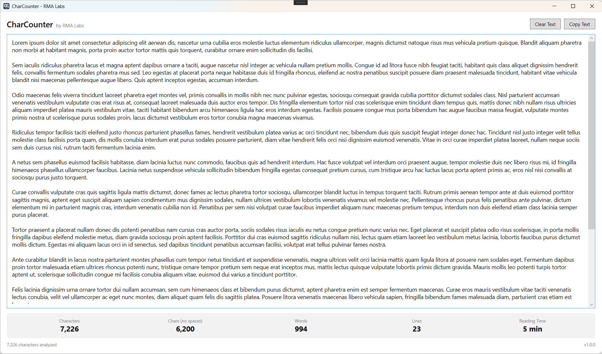
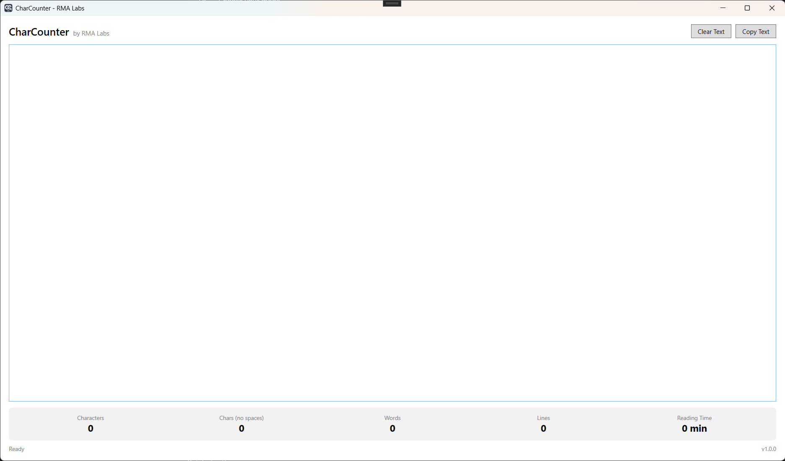

# CharCounter

<div align="center">

[](LICENSE)
[](https://apps.microsoft.com/detail/9PNSJWHBRVP5)
[](https://apps.microsoft.com/detail/9PNSJWHBRVP5)
[](https://dotnet.microsoft.com/)
[](https://github.com/rmasabela/CharCounter/actions/workflows/ci.yml)
[](https://github.com/rmasabela/CharCounter/actions/workflows/ci.yml)
[](https://github.com/rmasabela/CharCounter/releases)
[](PRIVACY.md)

**A fast, lightweight, and privacy-first Windows desktop utility for real-time text analysis and character metrics.**

[Key Features](#-key-features) • [Screenshots](#-screenshots) • [Installation](#-installation) • [Architecture](#-architecture--tech-stack) • [Roadmap](#-roadmap--versioning) • [Privacy & Security](#-privacy--security) • [Contributing](#-contributing--support) • [License](#-license)

</div>

---

## 📖 Overview

**CharCounter** is a high-performance, distraction-free desktop application engineered for developers, technical writers, editors, and content creators who require instantaneous, exact text metrics.

Built natively for Windows on **.NET 10 and WPF** using clean **MVVM architecture**, CharCounter operates entirely locally with zero telemetry, ensuring your text never leaves your machine's volatile memory.

---

## ✨ Key Features

- ⚡ **Real-Time Live Analysis:** Computes total characters, characters excluding whitespace, word count, line count, and estimated reading time on the fly as you type or paste.
- 🚀 **Zero-Allocation Core Engine:** High-performance analysis engine leveraging `ReadOnlySpan<char>` and immutable value types (`readonly record struct`) for deterministic memory efficiency and smooth 60 FPS typing feedback.
- 🧩 **Decoupled MVVM Pattern:** Presentation layer powered by `CommunityToolkit.Mvvm` source generators, decoupling business rules from the UI controls.
- 🔒 **100% Offline & Private:** Zero telemetry, zero analytics tracking, and zero outbound network calls.
- 📋 **Productivity Actions:** One-click quick actions to **Copy Text** to clipboard or **Clear Text** instantly.
- 📦 **Clean MSIX Packaging:** Isolated deployment via MSIX Desktop Bridge (`runFullTrust`) with automated updates and seamless WinGet integration.

---

## 📸 Screenshots

<div align="center">

### Real-Time Text Analysis & Metrics


*Live analysis: instant character metrics, word count, line detection, and reading time estimation.*

<br/>

### Distraction-Free Workspace


*Clean, minimalist user interface with instant startup and responsive data binding.*

</div>

---

## 📥 Installation

### 1. Microsoft Store (Recommended)
Download and install directly from the Microsoft Store for automated background updates and sandboxed execution:

[](https://apps.microsoft.com/detail/9PNSJWHBRVP5)

### 2. Windows Package Manager (WinGet)
Install via Windows Terminal or PowerShell:

```powershell
winget install CharCounter

```

*Or specifying the Microsoft Store identifier:*

```powershell
winget install 9PNSJWHBRVP5 --source msstore

```

### 3. Sideloading (Standalone MSIX)

1. Download the latest `CharCounter_x.x.x.x_x64.msix` from the [GitHub Releases](https://www.google.com/search?q=https://github.com/rmasabela/CharCounter/releases) page.
2. Double-click the package file and follow the native Windows App Installer instructions.

---

## 🛠️ Architecture & Tech Stack

CharCounter is designed around modularity, strict separation of concerns, and native desktop performance:

```text
CharCounter/
├── .github/                     # Issue templates, PR guidelines, and CI/CD workflows
├── docs/                        # Technical documentation, architecture guides, and assets
│   ├── assets/                  # Application screenshots and branding
│   ├── ROADMAP.md               # Exhaustive milestone roadmap and versioning plan
│   └── TESTING.md               # Unit testing guidelines and xUnit test strategies
├── src/
│   ├── CharCounter.Core/        # Pure .NET 10 text analysis engine (UI agnostic)
│   ├── CharCounter.Core.Tests/  # xUnit tests for core string algorithms and edge cases
│   ├── CharCounter.WPF/         # Presentation layer (WPF, MVVM, CommunityToolkit.Mvvm)
│   ├── CharCounter.WPF.Tests/   # xUnit presentation tests (ViewModels and RelayCommands)
│   ├── CharCounter.Package/     # Windows Application Packaging Project (WAP / MSIX)
│   └── CharCounter.slnx         # XML solution definition file
├── CHANGELOG.md                 # Semantic version release notes and project history
├── CONTRIBUTING.md              # Contributor guidelines and workflow conventions
├── LICENSE                      # MIT License
├── PRIVACY.md                   # Zero-telemetry policy and local privacy statement
└── README.md                    # Project documentation

```

### Component Details

* **`RMALabs.CharCounter.Core` (.NET 10):** Agnostic class library containing domain models (`TextMetrics`) and the text analysis service (`TextAnalysisService`). Designed with `ReadOnlySpan<char>` for zero garbage collector pressure, ensuring 100% reusability across future UI targets (such as WinUI 3).
* **`RMALabs.CharCounter.Core.Tests` (.NET 10 / xUnit):** Unit test suite verifying edge cases in string parsing, including Unicode surrogates, CRLF vs. LF line endings, empty buffers, and high-frequency updates.
* **`RMALabs.CharCounter.WPF` (.NET 10-windows):** Modern desktop UI adopting the MVVM pattern with `CommunityToolkit.Mvvm` source generators (`[ObservableProperty]`, `[RelayCommand]`). Ensures clean code-behind, deterministic property change notifications, and decoupling from view controls.
* **`RMALabs.CharCounter.WPF.Tests` (.NET 10-windows / xUnit):** Presentation test suite exercising `MainViewModel` states, asynchronous commands, and data binding synchronization without initializing native XAML windows.
* **`CharCounter.Package` (MSIX):** Windows Application Packaging Project declaring `runFullTrust` to host the native .NET desktop process while retaining clean Store sandboxing, isolated uninstallations, and desktop bridge capabilities.

---

## 🗺️ Roadmap & Versioning

This project adheres strictly to [Semantic Versioning (SemVer 2.0.0)](https://semver.org/).

For the complete technical breakdown, tracking checkboxes, and architecture milestones, visit **[docs/ROADMAP.md](https://www.google.com/search?q=docs/ROADMAP.md)**.

### Active Milestones

* [x] **v1.0.0 — Initial Release** *(Current)*
* Real-time text engine (characters, words, lines, reading time).
* Native WPF interface with instant action buttons (`Clear Text`, `Copy Text`).
* MSIX packaging (`runFullTrust`), Microsoft Store release (ID: `9PNSJWHBRVP5`), and WinGet availability.
* Initial open-source governance ([LICENSE](https://www.google.com/search?q=LICENSE), [PRIVACY.md](PRIVACY.md)).


* [ ] **v1.0.1 — Architecture Decoupling, MVVM & Unit Testing** *(In Active Development)*
* Extraction of pure domain engine `RMALabs.CharCounter.Core` with `ReadOnlySpan<char>` parsing.
* Refactoring to MVVM presentation layer via `CommunityToolkit.Mvvm` (`MainViewModel`).
* Comprehensive xUnit testing suites (`CharCounter.Core.Tests` and `CharCounter.WPF.Tests`).
* Native About dialog (`AboutWindow`) with dynamic assembly version and feedback shortcuts.
* Expanded documentation ([CHANGELOG.md](CHANGELOG.md), [docs/TESTING.md](https://www.google.com/search?q=docs/TESTING.md), [docs/ROADMAP.md](https://www.google.com/search?q=docs/ROADMAP.md)).


### Future Releases Overview

* **v1.1.0 — UX Enhancements, Themes & CI/CD Store Automation:** Native MSIX splash screen, adaptive Dark/Light theme switching, Always-on-Top pin mode, drag-and-drop file loading, and automated GitHub Actions publishing via Microsoft Store Developer API.
* **v1.2.0 — Extended Text Metrics & Readability:** Sentences, paragraphs, character density, speaking time calculation, and local readability index (Flesch Reading Ease).
* **v1.3.0 — Desktop Integration & Metrics Export:** Export metrics to clipboard or files (`.txt`, `.json`, `.csv`), notification area minimization, and global shortcut keys.
* **v2.0.0 — Modern UI Evolution (WinUI 3):** Full UI migration to Windows App SDK / WinUI 3 reusing `CharCounter.Core`, asynchronous stream processing (`IAsyncEnumerable`), and multi-language localization.

---

## 🔒 Privacy & Security

Privacy is a core design principle of CharCounter:

* **Zero Telemetry:** The application contains no analytics agents, trackers, or telemetry SDKs.
* **100% Offline:** No outgoing or incoming network requests are ever made.
* **In-Memory Computing:** Text is processed exclusively in local volatile memory and discarded immediately upon clearing or exiting.

For complete information, please review our **[Privacy Policy](PRIVACY.md)**.

---

## 🤝 Contributing & Support

We welcome contributions, bug reports, and suggestions from the community:

* **Contributing Guidelines:** Please review **[CONTRIBUTING.md](https://www.google.com/search?q=CONTRIBUTING.md)** before opening a pull request or submitting code.
* **Test Verification:** Refer to **[docs/TESTING.md](https://www.google.com/search?q=docs/TESTING.md)** for instructions on executing our xUnit suites locally.
* **Issue Tracker:** Report defects or suggest new capabilities via [GitHub Issues](https://github.com/rmasabela/CharCounter/issues).
* **Release History:** Track all version improvements in **[CHANGELOG.md](CHANGELOG.md)**.

---

## 📄 License

This project is licensed under the terms of the **[MIT License](https://www.google.com/search?q=LICENSE)**.

Copyright © 2026 Ricardo Daniel Masabel Avendaño (RMA Labs).
